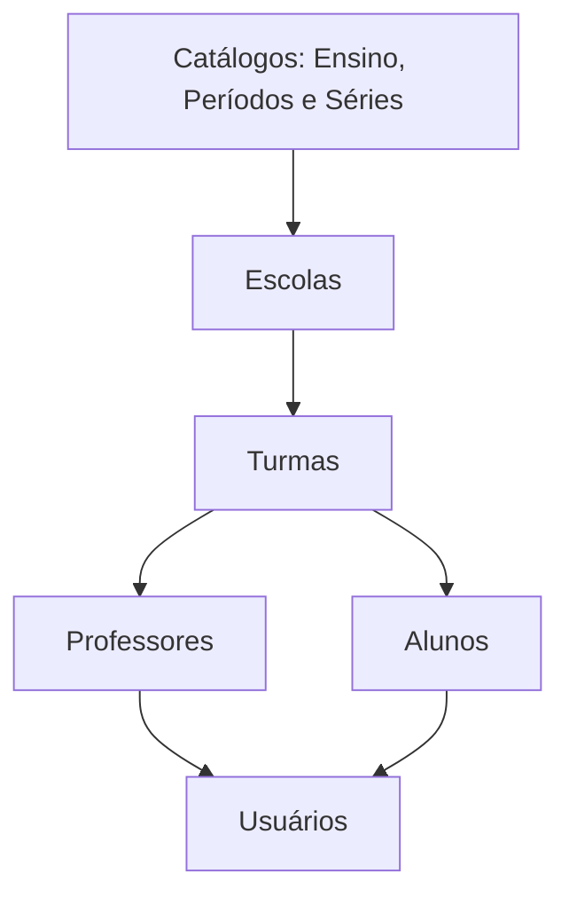

# Fluxo de integração recomendado

<Steps>
  <Step title="Consultar catálogos auxiliares">
    Consulte modalidades de ensino, períodos e séries para obter os IDs necessários.
  </Step>
  <Step title="Criar ou consultar escolas">
    Use `/schools` para cadastrar ou recuperar as escolas do gestor.
  </Step>
  <Step title="Criar turmas">
    Use `/classes` vinculando `school_id`, `teaching_id`, `period_id` e `serie_id`.
  </Step>
  <Step title="Cadastrar professores">
    Use `/teachers` informando as turmas associadas no campo `classes`.
  </Step>
  <Step title="Cadastrar alunos">
    Use `/students` informando a turma no campo `class_id`.
  </Step>
  <Step title="Redefinir senhas, quando necessário">
    Use `/sendmail` para disparar redefinição de senha para usuários ativos.
  </Step>
</Steps>

## Dependências entre entidades

